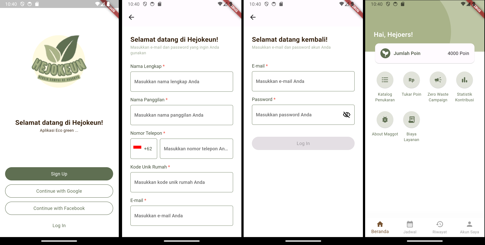

# Hejokeun

## Deskripsi

Hejokeun adalah sebuah aplikasi yang memberikan layanan pengelolaan sampah rumah tangga. Hejokeun akan menyediakan update informasi seputar jemput sampah, konversi sampah menjadi poin, pemisahan sampah (organik, botol, minyak jelantah, dan lainnya), pemesanan dan pemeliharaan maggot, kampanye zero waste, pembayaran dan pemotongan biaya, dan statistik dampak baik yang diberikan user ke bumi. Aplikasi Hejokeun ini akan digunakan oleh pemilik rumah dan karyawan Hejokeun. Pemasukan dari bisnis Hejokeun ini berasal dari biaya layanan bulanan jemput sampah pada komplek rumah yang telah bekerja sama dengan Hejokeun (include potongan diskon pembiayaan dari banyak botol dan minyak jelantah yang diberikan pemilik rumah pada Hejokeun), biaya jual botol dan minyak jelantah ke pihak pengepul, biaya jual dan pemeliharaan maggot pemilik rumah, dan biaya jual sampah organik ke pihak peternak maggot.

## Daftar Isi

-   [Technology Stack](#technology-stack)
-   [Features](#features)
-   [Screenshots](#screenshots)
-   [Created By](#created-by)

## Technology Stack

-   Flutter 3.16.5
-   Firebase

## Features

-   User Login dan Register
    Pengguna dapat menggunakan aplikasi Hejokeun dengan melakukan login dengan akun yang dimilikinya. Bila pengguna belum memiliki akun, maka ia dapat mendaftarkan akun dengan menggunakan kode unik rumah yang dimiliki. Login dan register dapat dilakukan menggunakan email dan password, Google, dan Facebook.
-   Main menu
    Tampilan awal yang ditunjukan ke pengguna setelah melakukan login. Pada tampilan ini pengguna dapat menuju ke fitur-fitur yang ingin digunakannya.

## Screenshots

Urutan kiri-kanan: Layar selamat datang, Layar register, Layar login, Layar tampilan utama

## Created By

| No  | Role    | Nama                |
| --- | ------- | ------------------- |
| 1   | Hustler | Ananda Abdul Hafizh |
| 2   | Hipster | Cathleen Lauretta   |
| 3   | Hacker  | Fawwaz Abrial Saffa |
| 4   | Hacker  | Frendy Sanusi       |
